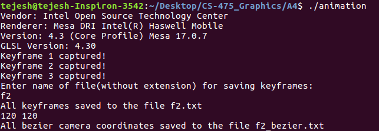
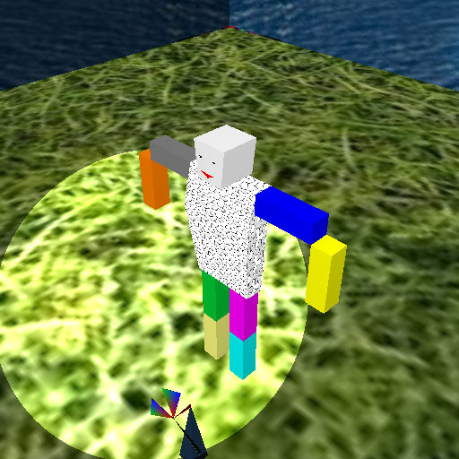
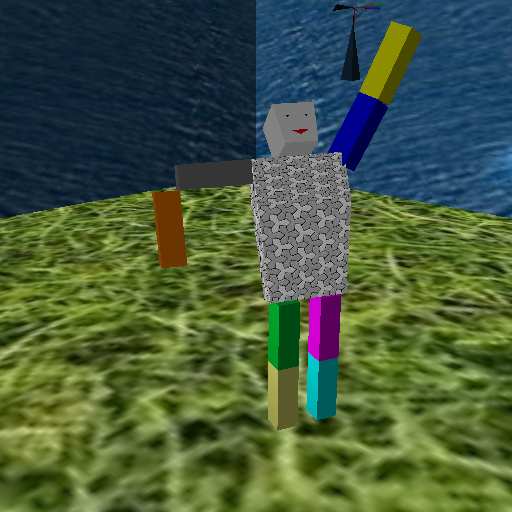

You can find sample video animation made using this tool [here](https://youtu.be/vNn5GJM4XJw)

### How to run?

Open the folder A4 *(where makefile is present)* in terminal and run the
command "**make**" to compile the project. To open the project open the
executable using the command "**./animation**".

By default it is in Recoding mode

**To record keyframes for animation:**

Make suitable changes in the screen and then press "**K**" to capture
the keyframe. After all keyframes have been captured, press "**L**" to
save them to a file.

Keyframes will contain the value of camera coordinates, field of view of
camera, lights status and translation parameters, rotational parameters
of both toys. While playing animation all these keys will be linearly
interpolated

While saving the keyframes, one more file containing the interpolated
camera coordinates, of the Bezier curve created using camera coordinates
from keyframes as control points, will also be saved. This will be used
when user wishes to move camera along the Bezier curve while playback

**To playback the animation using already created keyframe:**

Press **P** and then enter filename of keyframe. It will also ask if you
want camera coordinates to be in Bezier curve or linearly interpolated.
Specify the file containing Bezier coordinates if asked. Files final.txt
and final\_bezier.txt already given for the same

Image frames will be saved in the folder "image\_frames". They will be
inverted and in ppm file format. To correct orientation and convert to
jpg format enter the command: \
**make jpg\_flip anim\_name=&ltanimation name\>**

To make video out of these frames enter the command: \
**make myvideo anim\_name=&ltanimation name\>**\
Video will be saved in the video folder in "avi" file format

To add audio to the video, enter the command: \
**make attach\_sound anim\_name=&ltanimation name\>**\
A default audio saved in sample\_audio folder will be attached. You can
change the audio file by editing makefile

Final video will be saved in the "**final\_video**" folder

Controls:
---------

You need to select any object before applying rotations to it. Initially
camera is placed at the position (1.5, 1.5, 1.5) and has field of view
45 degrees. Here are the controls needed for the same:

-   "**K**" - Capture current key-frame
-   "**L**" - Save all captured key-frames to file
-   "**P**" - Start/Stop Playback of animation
-   "**1**" - Select lower object number
-   "**2**" - Select higher object number
-   "**3**" - Toggle between models- Humanoid and simple toy(windmill)
-   "**4**" - Turn ON/OFF the first directional light coming from the
    infinite position (0.5, 0.0, 1.0, 0.0) which means light comes from
    little right side from front
-   "**5**" - Turn ON/OFF the second directional light coming from the
    infinite position (0.0, 1.0, 0.0, 0.0) which means light comes from
    the top side
-   "**6**" - Turn ON/OFF the spotlight
-   "**W**" - translate along positive y axis by 0.1
-   "**S**" - translate along negative y axis by 0.1
-   "**A**" - translate along negative x axis by 0.1
-   "**D**" - translate along positive x axis by 0.1
-   "**Z**" - translate along negative z axis by 0.1
-   "**X**" - translate along positive z axis by 0.1
-   "**N**" - **zooms in**: decreases the field of view of camera
-   "**M**" - **zooms out**: increases the field of view of the camera
-   "**UP**" - rotation along 2st axis by -1
-   "**DOWN**" - rotation along 2st axis by +1
-   "**LEFT**" - rotation along 2nd axis by -1
-   "**RIGHT**" - rotation along 2nd axis by +1
-   "**PgUp**" - rotation along 3rd axis by -1
-   "**PgDn**" - rotation along 3rd axis by +1
-   "**T**" - translate camera along positive y axis by 0.1
-   "**G**" - translate camera along negative y axis by 0.1
-   "**F**" - translate camera along negative x axis by 0.1
-   "**H**" - translate camera along positive x axis by 0.1
-   "**V**" - translate camera along negative z axis by 0.1
-   "**B**" - translate camera along positive z axis by 0.1

Hierarchical Models:
--------------------

Position coordinates, normals, color, heirarchy, etc of models are well
commented and stored in the files humanoid\_coordinates.hpp,
windmill\_coordinates.hpp and cube\_coordinates.hpp.

### Humanoid toy:

\
 All objects can be rotated along any axis, except the lower arms and
legs. Lower arms can be rotated only along the 3rd axis and lower legs
can be rotated only along the 1st axis.

### Simple toy(Windmill):

\
 Base can be rotated along any axis. Pivot can be rotated only along 1st
axis. Fan can be rotated only along 3rd axis.

Images:
-------

When all lights are turned ON:

When all lights are turned ON except the first directional light:

When all lights are turned ON except the second directional light:

When all lights are turned ON except the spot-light:

Just some random images after few transformations:

 

References
----------

-   [GLFW: Time input](http://www.glfw.org/docs/3.0/group__time.html)
-   [Capturing the OpenGL Screen to PPM images and making video from
    captured
    frames](https://www.cse.iitb.ac.in/~paragc/teaching/2017/cs475/demonotes.shtml)
-   [Tutorial 3 :
    Matrices](http://www.opengl-tutorial.org/beginners-tutorials/tutorial-3-matrices/)
-   [GLSL Tutorial – Spotlights »
    Lighthouse3d.com](http://www.lighthouse3d.com/tutorials/glsl-tutorial/spotlights/)
-   [Send a BOOL value to a Fragment Shader OpenGL ES 2.0 on iOS /
    iPhone - Stack
    Overflow](https://stackoverflow.com/questions/11380619/send-a-bool-value-to-a-fragment-shader-opengl-es-2-0-on-ios-iphone)
-   [Tutorial 5:
    Shading](https://github.com/paragchaudhuri/cs475-tutorials/tree/master/Tutorial_05)
-   [Tutorial 6:
    Texturing](https://github.com/paragchaudhuri/cs475-tutorials/tree/master/Tutorial_06)

